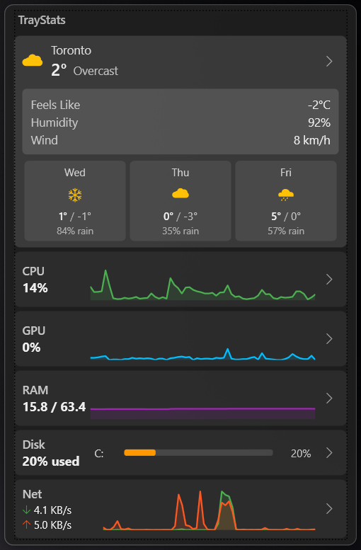

<p align="center">
  
</p>

<h1 align="center">TrayStats</h1>

<p align="center">
  <b>Real-time system monitoring in your tray.</b>
</p>

TrayStats is a lightweight Windows app that puts live CPU, GPU, RAM, disk, network, battery, and more in your system tray. It shows a dynamic live-updating icon and pops up a rich dashboard when clicked -- no need to open Task Manager just to see how your system is doing.

This project was vibecoded by a developer who missed having quick system stats without opening Task Manager every five seconds.

---

## Table of Contents

- [Features](#features)
- [Installation](#installation)
- [Usage](#usage)
- [Dashboard](#dashboard)
  - [Weather](#weather)
  - [Top Processes](#top-processes)
  - [CPU](#cpu)
  - [GPU](#gpu)
  - [RAM](#ram)
  - [Disk](#disk)
  - [Battery](#battery)
  - [Bluetooth / Peripherals](#bluetooth--peripherals)
  - [Network](#network)
  - [System Uptime](#system-uptime)
- [Tray Icon Options](#tray-icon-options)
  - [Tray Metric](#tray-metric)
  - [Icon Style](#icon-style)
- [Section Visibility](#section-visibility)
- [Running as Admin](#running-as-admin)
- [Architecture](#architecture)
- [Known Limitations](#known-limitations)
- [Building from Source](#building-from-source)
- [License](#license)

---

## Features

| Feature | Detail |
|---|---|
| **Dynamic tray icon** | Live-updating icon showing CPU, GPU, or RAM usage in your system tray |
| **Multiple icon styles** | Bar, percentage text, or mini chart -- pick your preference |
| **Pop-up dashboard** | Click the tray icon to see a compact dashboard with sparkline charts and detailed stats |
| **CPU monitoring** | Total load, per-core usage bars, temperature, max clock, package power |
| **GPU monitoring** | Core load, temperature, core/memory clocks, VRAM usage, fan speed, power draw. Auto-detects active GPU on multi-GPU systems |
| **RAM monitoring** | Used / available / total memory, load percentage |
| **Disk monitoring** | Per-drive space usage, temperature, read/write speeds |
| **Battery monitoring** | Charge level, charge/discharge rate, voltage, time remaining, health, design/full charge capacity. Color-coded sparkline and charge bar (green -> yellow -> red based on level) |
| **Network monitoring** | Real-time download/upload speeds with sparkline history |
| **Top Processes** | Top 5 CPU-consuming processes with CPU and memory usage |
| **Bluetooth / Peripherals** | Connected and paired Bluetooth devices with device type icons and connection status |
| **System Uptime** | Time since last boot, OS version, machine name, user name |
| **Weather** | Current conditions and 3-day forecast via Open-Meteo (no API key needed) |
| **Section visibility** | Choose which sections appear on the dashboard via the right-click menu |
| **Expandable detail panels** | Click any section header to expand/collapse detailed stats |
| **Close button** | Close the dashboard without quitting the app |
| **Start with Windows** | Optional auto-start via the context menu |
| **Restart as Admin** | Elevate to get full sensor access without relaunching manually |
| **Single instance** | Mutex-based enforcement prevents duplicate instances |
| **Crash recovery** | Auto-restarts on unexpected crashes (up to 3 times in 60 seconds) with crash logging |
| **Smart polling** | Two-tier update throttling -- full-speed when dashboard is visible, minimal polling when hidden (only tray icon metric) |
| **Lightweight** | Pure WPF, no Electron, no web views. ~50MB RAM footprint |

---

## Installation

### Option 1: Download Release

Download the latest release from the [Releases](../../releases) page. Extract the zip and run `TrayStats.exe`.

> **Note:** You need the [.NET 8 Desktop Runtime](https://dotnet.microsoft.com/download/dotnet/8.0) installed. If you don't have it, Windows will prompt you to install it on first launch.

### Option 2: Build from Source

```powershell
git clone https://github.com/andruu/TrayStats.git
cd TrayStats
dotnet build
dotnet run
```

---

## Usage

1. Run `TrayStats.exe`
2. A dynamic icon appears in the system tray (bottom-right near the clock)
3. **Left-click** the tray icon to toggle the dashboard popup
4. **Right-click** the tray icon for options:
   - **Show Dashboard** -- open the popup
   - **Tray Metric** -- choose what the icon displays (CPU, GPU, or RAM)
   - **Icon Style** -- choose how the icon looks (Bar, Percentage, or Mini Chart)
   - **Sections** -- toggle which sections are visible on the dashboard
   - **Restart as Admin** -- relaunch with elevated privileges for full sensor data
   - **Start with Windows** -- toggle auto-start at login
   - **Exit** -- quit the app

> **Tip:** If the tray icon is hidden, click the `^` overflow arrow in the taskbar to find it, then drag it out to pin it permanently.

---

## Dashboard

The dashboard is a dark-themed popup window that anchors near your system tray. Each section shows a sparkline chart with 60 data points of history and a summary. Click the arrow on any section to expand its detail panel. Use the close button (top-right) to dismiss the dashboard without quitting the app.

### Weather

| Stat | Description |
|---|---|
| **Current Temp** | Current temperature at your location |
| **Condition** | Weather condition (Clear, Cloudy, Rain, Snow, etc.) with color-coded icon |
| **Feels Like** | Apparent temperature |
| **Humidity** | Relative humidity percentage |
| **Wind** | Wind speed in km/h |
| **3-Day Forecast** | High/low temps, color-coded condition icon, and precipitation probability for the next 3 days |

Location is auto-detected via IP geolocation. Weather updates every 15 minutes using the free [Open-Meteo](https://open-meteo.com/) API (no API key required).

Weather icons are color-coded by condition: **yellow** for sun/clear, **white** for clouds/fog, **blue** for rain/showers, **ice blue** for snow/freezing rain, and **purple** for thunderstorms.

### Top Processes

| Stat | Description |
|---|---|
| **Top Consumer** | Name of the process using the most CPU |
| **Process List** | Top 5 processes ranked by CPU usage, showing CPU % and memory in MB |

Updates every 3 seconds. Processes are grouped by name (e.g., multiple Chrome instances are combined).

### CPU

| Stat | Description |
|---|---|
| **Total Load** | Overall CPU utilization percentage |
| **Per-Core Bars** | Individual usage bars for each core (P-cores and E-cores) |
| **Temperature** | CPU package or average temperature |
| **Max Clock** | Highest current clock speed across all cores |
| **Package Power** | Total CPU package power draw |

### GPU

| Stat | Description |
|---|---|
| **Core Load** | GPU core utilization percentage |
| **Temperature** | GPU core temperature |
| **Core Clock** | Current GPU core clock speed |
| **Memory Clock** | Current GPU memory clock speed |
| **VRAM Used** | GPU video memory in use |
| **Fan Speed** | Fan RPM (may show N/A if fans are stopped at idle) |
| **Power** | GPU power draw |

On systems with multiple GPUs (integrated + discrete), TrayStats automatically detects the active GPU based on D3D usage. It prefers discrete GPUs (NVIDIA/AMD) when idle and uses hysteresis to prevent flip-flopping between GPUs.

### RAM

| Stat | Description |
|---|---|
| **Used / Total** | Physical memory usage in GB |
| **Available** | Free physical memory |
| **Load** | Memory utilization percentage with proportional usage bar |

### Disk

| Stat | Description |
|---|---|
| **Space bar** | Visual bar showing used vs total space per drive |
| **Total / Used / Free** | Drive capacity breakdown |
| **Temperature** | Drive temperature (requires admin on some systems) |

### Battery

| Stat | Description |
|---|---|
| **Charge Level** | Current battery percentage with sparkline history |
| **Charge Bar** | Full-width proportional bar with gradient color (green at high charge, yellow mid, red/orange low) |
| **Status** | Charging, Discharging, or Full |
| **Time** | Estimated time to full charge (e.g., "1h 23m to full") or time remaining on battery |
| **Charge Rate / Drain Rate** | Battery charge or discharge rate in watts (label changes based on state) |
| **Input Power** | Estimated total adapter wattage when plugged in (charge rate + CPU + GPU power) |
| **Voltage** | Current battery voltage |
| **Health** | Battery health percentage (current capacity vs design capacity) |
| **Design Capacity** | Original battery capacity in mWh |
| **Full Charge** | Current full charge capacity in mWh |

The battery section only appears on devices with a battery. The sparkline chart and charge bar use a smooth color gradient based on charge level: green (50-100%), yellow (20-50%), orange/red (0-20%).

### Bluetooth / Peripherals

| Stat | Description |
|---|---|
| **Connected Count** | Number of actively connected Bluetooth devices |
| **Device List** | All paired and connected devices with type icon, name, and connection status |

Device types are auto-classified (headphones, mouse, keyboard, gamepad, etc.) with appropriate icons. Uses Windows WinRT Bluetooth APIs for accurate real-time connection status. Updates every 15 seconds.

### Network

| Stat | Description |
|---|---|
| **Download speed** | Current download rate |
| **Upload speed** | Current upload rate |
| **Sparkline charts** | Separate download/upload history graphs |

### System Uptime

| Stat | Description |
|---|---|
| **Uptime** | Time since last system boot (e.g., "2d 5h 30m") |
| **OS Version** | Windows version string |
| **Machine Name** | Computer name |
| **User** | Current logged-in user |
| **Boot Time** | Date and time of last system boot |

Updates every 60 seconds.

---

## Tray Icon Options

### Tray Metric

Choose which metric the tray icon displays:

| Option | Icon Shows |
|---|---|
| **CPU** | CPU total load percentage |
| **GPU** | GPU core load percentage |
| **RAM** | Memory load percentage |

### Icon Style

Choose the visual style of the tray icon:

| Style | Description |
|---|---|
| **Bar** | Vertical fill bar -- higher usage = taller bar. Green/yellow/red color coding |
| **Percentage** | Numeric percentage text rendered directly on the icon |
| **Mini Chart** | Rolling 16-sample bar chart showing recent history |

All styles use color coding: **green** (< 60%), **yellow** (60-85%), **red** (> 85%).

---

## Section Visibility

Right-click the tray icon and open the **Sections** submenu to toggle which sections appear on the dashboard. All sections are enabled by default. Available toggles:

- Weather
- Top Processes
- CPU
- GPU
- RAM
- Disk
- Battery
- Bluetooth
- Network
- System Uptime

---

## Running as Admin

Some hardware sensors (CPU temperature, disk temperature, GPU fan speed) require administrator privileges to read. Without admin:

- These values will show **N/A** in the dashboard
- Everything else (load percentages, memory, disk space, network) works normally

To get full sensor data:

1. Right-click the tray icon
2. Click **Restart as Admin**
3. Accept the UAC prompt

The app seamlessly restarts itself with elevated privileges. Your dashboard state and settings are preserved.

> **Note:** Some very new CPUs (e.g., Intel Arrow Lake / Core Ultra 200 series) may show N/A for temperature, clock, and power even with admin access. This is a known limitation of the underlying hardware monitoring library ([LibreHardwareMonitor](https://github.com/LibreHardwareMonitor/LibreHardwareMonitor)) which hasn't added full support for these processors yet. WMI fallbacks are used where available.

---

## Architecture

TrayStats follows SOLID principles with dedicated monitor services per hardware type and a shared hardware context.

```
TrayStats/
  App.xaml / App.xaml.cs         Entry point, tray icon, context menu, single-instance mutex

  Models/
    CpuData.cs                   CPU model (total load, per-core, temp, clock, power)
    GpuData.cs                   GPU model (load, temp, clocks, VRAM, fan, power)
    RamData.cs                   RAM model (used, available, total, load)
    DiskData.cs                  Disk model (drive info, temp, read/write rates)
    NetData.cs                   Network model (download/upload speeds, formatters)
    BatteryData.cs               Battery model (charge, rate, voltage, health, capacity)
    WeatherData.cs               Weather model (current conditions, forecast, WMO code mapper)
    ProcessData.cs               Process model (top CPU consumers, memory usage)
    BluetoothData.cs             Bluetooth model (device list, connection status)
    UptimeData.cs                Uptime model (uptime, OS, machine, user, boot time)
    SectionVisibility.cs         Observable toggles for dashboard section visibility

  Services/
    IMonitorService.cs           Common interface for all monitor services
    HardwareContext.cs            Shared LibreHardwareMonitor Computer instance and update loop
    CpuMonitorService.cs         CPU monitoring + WMI fallback
    GpuMonitorService.cs         GPU monitoring + multi-GPU detection + D3D fallback
    RamMonitorService.cs         RAM monitoring via P/Invoke GlobalMemoryStatusEx
    BatteryMonitorService.cs     Battery monitoring via LHM + GetSystemPowerStatus P/Invoke
    DiskMonitorService.cs        Disk space via System.IO.DriveInfo + LHM for temps
    NetworkMonitorService.cs     Network bandwidth via System.Net.NetworkInformation
    WeatherService.cs            Open-Meteo API + IP geolocation for weather data
    ProcessMonitorService.cs     Top process tracking via System.Diagnostics.Process
    BluetoothMonitorService.cs   Bluetooth devices via WinRT Windows.Devices.Bluetooth APIs
    UptimeMonitorService.cs      System uptime via Environment.TickCount64

  ViewModels/
    DashboardViewModel.cs        MVVM ViewModel, sparkline data, relay commands

  Views/
    DashboardPopup.xaml(.cs)     WPF popup window with dark theme, positioned near tray
    Components/
      SparklineChart.cs          Custom WPF Canvas control for sparkline rendering

  Helpers/
    IconGenerator.cs             Dynamic 16x16 tray icon bitmap generation
    Converters.cs                WPF value converters (percent-to-width, sensor formatting)
    StartupHelper.cs             Windows startup registry management
```

### Key Libraries

| Library | Purpose |
|---|---|
| [LibreHardwareMonitorLib](https://github.com/LibreHardwareMonitor/LibreHardwareMonitor) | CPU/GPU temps, clocks, fan speeds, power, disk health, battery sensors |
| [H.NotifyIcon.Wpf](https://github.com/HavenDV/H.NotifyIcon) | Modern system tray icon for WPF |
| [CommunityToolkit.Mvvm](https://github.com/CommunityToolkit/dotnet) | MVVM base classes, ObservableObject, RelayCommand |
| System.Management | WMI queries as fallback for unsupported hardware |
| Windows.Devices.Bluetooth | WinRT APIs for accurate Bluetooth connection status |
| [Open-Meteo API](https://open-meteo.com/) | Free weather data (no API key), current conditions + forecast |

### Data Flow

```
Hardware Sensors (HardwareContext)
    |
    v
Per-hardware Monitor Services (CPU, GPU, RAM, Battery, Disk, etc.)
    |
    v
DashboardViewModel (ObservableProperties, data binding, UI-thread dispatch)
    |
    +---> DashboardPopup (WPF UI, sparklines, detail panels)
    +---> App.xaml.cs (tray icon update every 2s)

Two-tier polling:
  Dashboard VISIBLE (foreground mode):
    HardwareContext         1s interval
    DiskMonitorService      5s interval
    NetworkMonitorService   1s interval
    ProcessMonitorService   3s interval
    BluetoothMonitorService 15s interval
    UptimeMonitorService    60s interval
    WeatherService          15 min interval

  Dashboard HIDDEN (background mode):
    HardwareContext         5s interval (tray icon only)
    DiskMonitorService      30s interval
    WeatherService          15 min interval
    Network, Processes, Bluetooth, Uptime -- STOPPED
```

---

## Known Limitations

| Limitation | Detail |
|---|---|
| **Intel Arrow Lake** | Core Ultra 200 series CPUs have incomplete sensor support in LibreHardwareMonitor. Temperature, clock, and power may show N/A even with admin. WMI fallbacks provide partial data |
| **Laptop GPU fans** | Modern NVIDIA laptop GPUs stop fans at idle. Fan speed showing 0 RPM / N/A at low temps is expected behavior |
| **Admin required for full data** | Some sensors need elevated privileges. Use "Restart as Admin" from the tray menu |
| **Single monitor positioning** | The dashboard popup positions relative to the primary taskbar. Multi-monitor setups with taskbars on secondary displays may need manual adjustment |
| **Bluetooth scan interval** | Bluetooth device status updates every 15 seconds; very brief connections may be missed between scans |

---

## Building from Source

### Prerequisites

- Windows 10 (19041+) / Windows 11
- [.NET 8 SDK](https://dotnet.microsoft.com/download/dotnet/8.0)

### Build

```powershell
cd TrayStats
dotnet build
```

### Run

```powershell
dotnet run
```

### Publish Self-Contained

```powershell
dotnet publish -c Release -r win-x64 --self-contained -o dist
```

This produces a self-contained build in `./dist/` that includes the .NET runtime. No .NET installation required on the target machine.

---

## License

MIT
